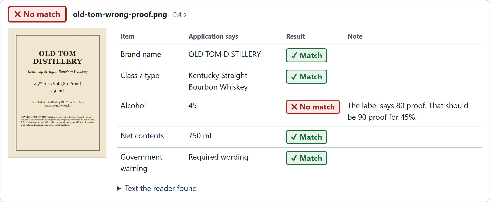
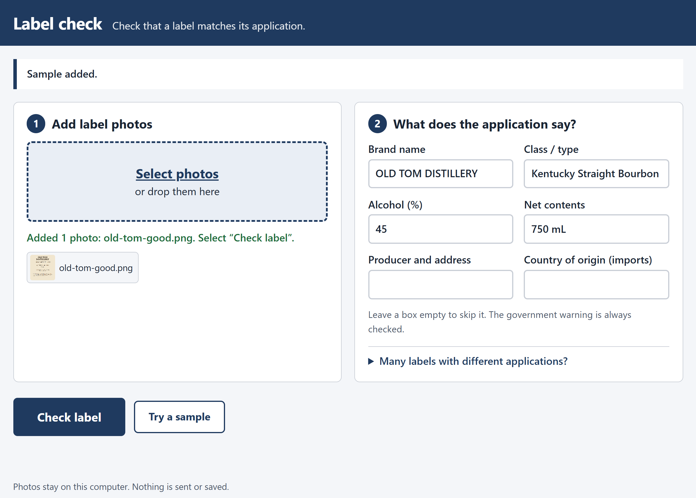
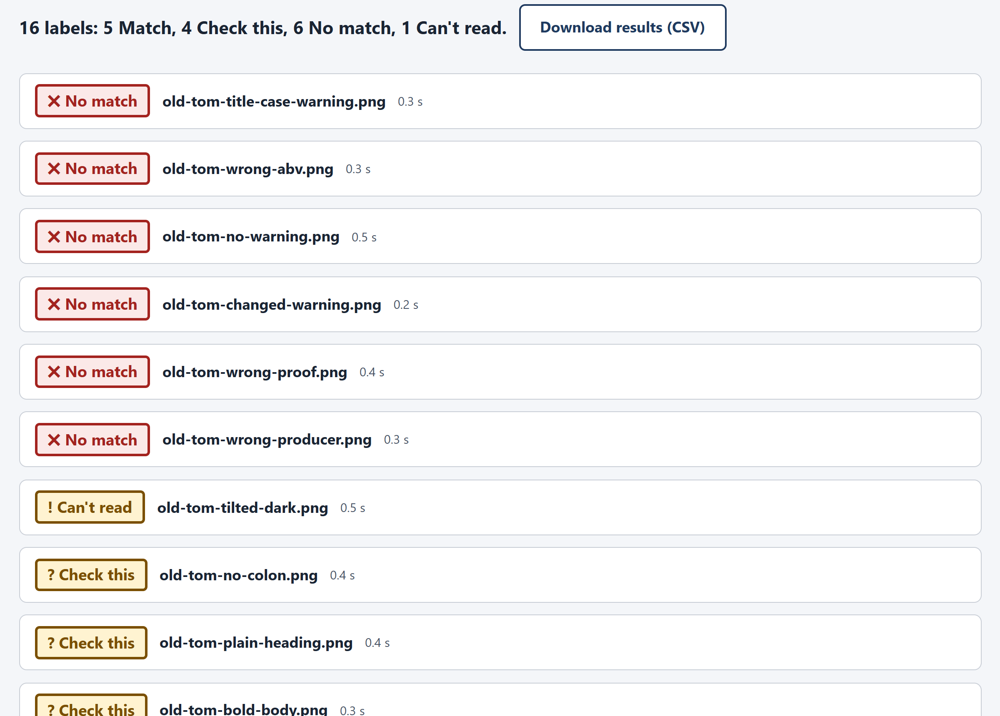

# Label check

Check an alcohol label against its application in about a second.
AI reads the label. Plain rules decide. The photo never leaves your computer.

**Live app:** https://zach-wendt.github.io/label-check/



## Try it

1. Open the live app.
2. Select **Try a sample**, then **Check label**.
3. To try a batch, select all 16 photos in [`public/samples/`](public/samples), open
   **Many labels with different applications?**, add [`batch.csv`](public/samples/batch.csv), and select
   **Check 16 labels**.

A product often has several labels: front, back, neck. Add all its photos together and they are checked as
one product. For a batch, a CSV row names them: `front.jpg; back.jpg`.



A batch shows the labels with problems first:



## What it checks

| Item | The rule | Example result |
|---|---|---|
| Brand, class/type, producer and address, country of origin | Same words. Capitals, punctuation, spaces and word order do not count. `whisky` = `whiskey`. | `STONE'S THROW` vs `Stone's Throw`: **Match**. `OLD TIM` vs `OLD TOM`: **Check this**. |
| Alcohol | The label's % equals the application's %. If the label gives proof, proof must be 2 × the %. | 40% vs 45%: **No match**. 45% with 80 Proof: **No match**. |
| Net contents | Same amount after unit change. | `75 cL` vs `750 mL`: **Match**. `12 FL OZ` vs `355 mL`: **Match**. |
| Government warning | Every word of 27 CFR 16.21 is there. `GOVERNMENT WARNING:` in capitals, with the colon, in bold; the rest not bold (27 CFR 16.22). | `Government Warning:`: **No match**. Rewritten warning: **No match**. A missing word: **Check this**, and the note names it. |

Every result uses one of four words:

- **Match**: the label agrees with the application.
- **Check this**: close, but a person must look. The note says what to look at.
- **No match**: the label disagrees with the application.
- **Can't read**: the photo is too poor to check. Add a clearer photo.

Labels with a problem show first. **Download results (CSV)** saves every row.

## How it works

```
photos → gray, full contrast → AI reads the text (in the browser) → rules → Match / Check this / No match / Can't read
```

- **AI reads the label.** PaddleOCR (PP-OCRv6 tiny, 6.4 MB) is two neural networks: one finds the text, one
  reads it. It runs in the browser on the user's own computer. There is no server and no outside network call,
  so a strict firewall does not block it. If no warning is found, it reads the photo again turned sideways,
  because cans often print the warning that way.
- **Rules decide.** Rules are fast, give the same answer every time, are easy to test, and are easy to
  explain to an auditor. They are in [`src/match.js`](src/match.js).
- **Bold is measured from the pixels.** Bold letters have thicker strokes. The tool compares stroke width in
  the warning heading with the text after it ([`src/bold.js`](src/bold.js)).

**Approach, tools used, and assumptions made:** [APPROACH.md](APPROACH.md). It starts with a short summary, then gives the reasons, the test results, and the limits.

## Measured

- **Sample labels:** all 16 give the expected result (table in [APPROACH.md](APPROACH.md)). 0.2 to 0.5 seconds
  each.
- **Real labels:** 15 approved labels from the TTB COLA public registry (wine, beer, bourbon, scotch, liqueur;
  1 to 3 photos each). 7 **Match**, 6 **Check this**, 2 **No match**. All 15 are approved, so the 2 No match
  are false alarms; the reasons are in [APPROACH.md](APPROACH.md#real-labels). 0.8 to 2.1 seconds per product.
- One Windows PC, Edge. The first visit downloads about 20 MB (the model and its runtime). The browser can
  cache it for later visits.

## Run it on your computer

You need Node.js 22 or newer.

```
npm install
npm run build
npm start
```

Open http://localhost:8080.

## Test

```
npm test                         # unit tests for the rules, under 1 second
node scripts/e2e.mjs             # all sample labels in a real browser (needs Edge or Chrome)
node scripts/make-labels.mjs     # make the sample labels again
```

Set `BROWSER` to the path of Chrome or Edge if it is not in the default place. To run other labels:
`SAMPLES=<folder> CSV=<file> node scripts/e2e.mjs`.

## Files

```
src/match.js     The rules. Pure code: no screen, no OCR.
src/bold.js      Stroke width, for the bold check. Pure code.
src/csv.js       Reads the batch CSV and writes the results CSV.
src/worker.js    Reads the text in a background thread, so the page stays quick.
src/app.js       The screen.
public/          The site: page, models, sample labels.
docs/            Screenshots for this README.
scripts/         Build, local server, sample-label maker, browser test.
test/            Unit tests.
```

## Deploy

The site is static, so any static host works. The included workflow
([`.github/workflows/deploy.yml`](.github/workflows/deploy.yml)) tests, builds, and publishes to GitHub Pages.
Turn it on in **Settings > Pages > Source: GitHub Actions**.
